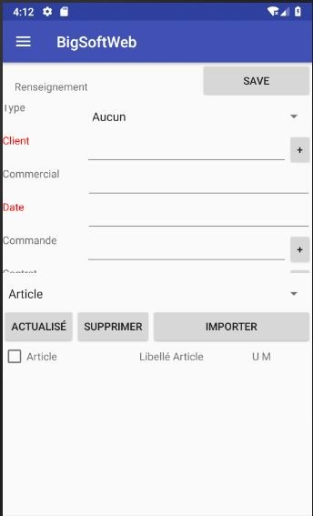

Une application mobile qui permet la getion des Ventes.

Cette Application a été implementer lors d'un stage chez : [BIG INFORMATIQUE Annaba](https://biginformatique.com).

cette application la version mobile qui offre quelques fonctionnalités du ERP [BIG SOFT](https://biginformatique.com/produits/application-bigsoft)

1- menu principal pour naviguer entre les différentes parties :

  

2- l'affichage des informations nécessaire : dans cet exemple j’affiche les informations sur les clients.

  

3- « fiche client » en cliquant sur un client, une page contenant toute les informations du client sélectionné s’affiche.

  

4- « Facture Client » l’ajout d’une nouvelle facture : saisir les informations puis sauvegarder.

  

